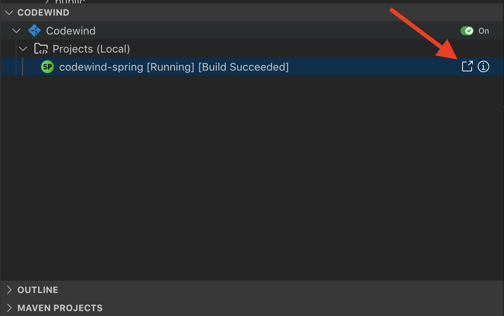
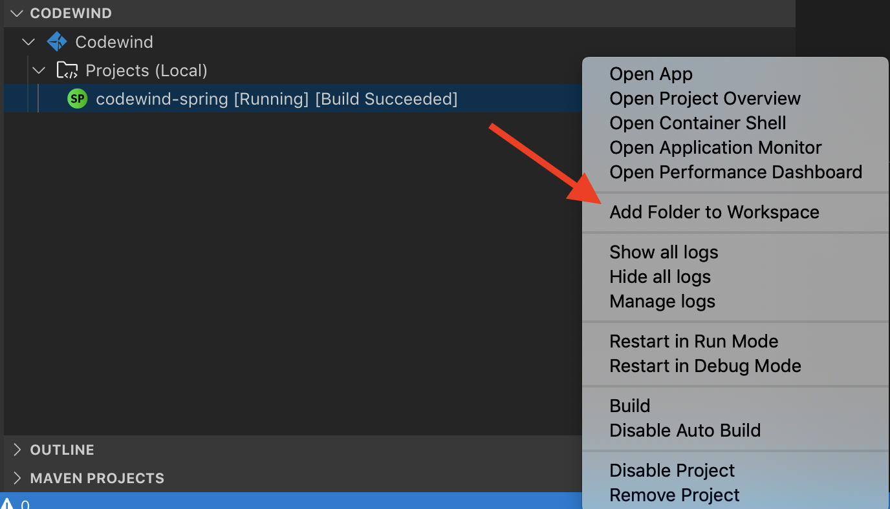
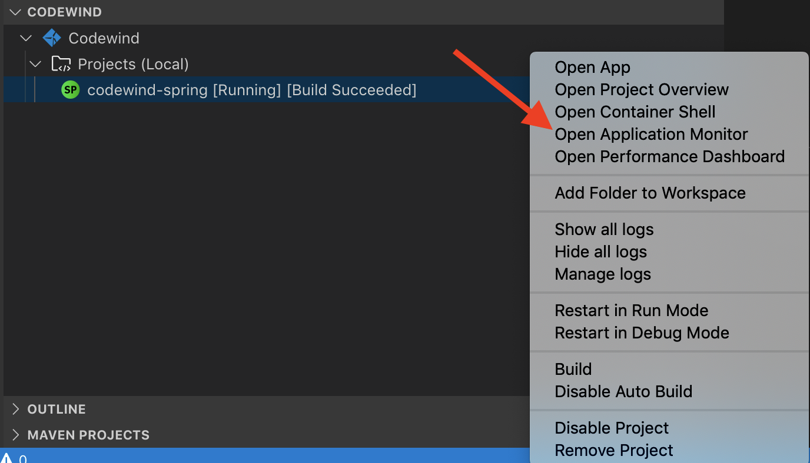
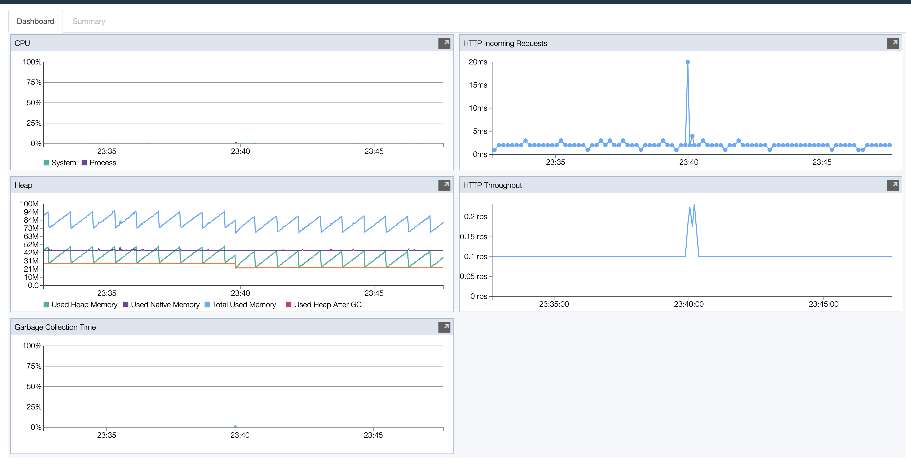
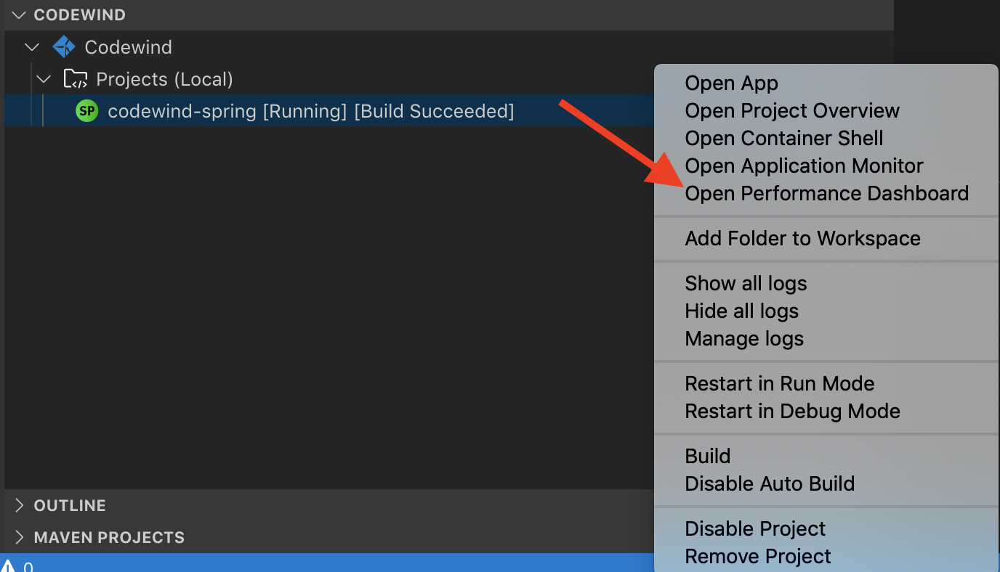

# Spring Boot Kabanero Quicklab

Kabanero is a set of open source projects supported by IBM to help developers quickly build and deploy cloud native applications. 

In this quicklab we will take a look at a couple of the projects under Kabanero; Appsody and Codewind and how they can help developers be more productive. 

## Prerequistes

Only needed if running steps on own machine

<details>
  <summary>Click to expand</summary>
  
### Configure Local System

This quicklab will require several command-line tools to be completed, you will need to have all the following installed. It is also generally recommended to have the most recent versions of these tools: 

1. Install Docker
2. Install minikube
2. Install kubectl
3. Install Appsody
4. Install VS Code
5. 	Install codewind extension
6. Install java extension


</details>

## Getting Familiar with Application with Appsody

[Appsody](https://appsody.dev/) is a command-line interface that can be used for the initialization of cloud native projects. Let's look at how to use Appsody to initialize a Spring Boot project. 

Appsody uses a concept called "stacks" that are templates to define how a project should be initialized, how it's Docker image should be built, and define how it should be deployed on a kubernetes cluster. To view available stacks run the following command:

```
$ appsody list
```

This prints out a list of available stacks including the repo they are being pulled from, their version, and the different types of templates. For example `java-spring-boot2` could be initialized as either a Java application "default" or a Kotlin application.

```
REPO        	ID                       	VERSION  	TEMPLATES        	DESCRIPTION                                              
appsodyhub  	java-microprofile        	0.2.12   	*default         	Eclipse MicroProfile on Open Liberty & OpenJ9 using Maven
appsodyhub  	java-spring-boot2        	0.3.10   	*default, kotlin 	Spring Boot using OpenJ9 and Maven                       
appsodyhub  	nodejs                   	0.2.5    	*simple          	Runtime for Node.js applications                         
appsodyhub  	nodejs-express           	0.2.5    	*simple, skaffold	Express web framework for Node.js                        
appsodyhub  	nodejs-loopback          	0.1.4    	*scaffold        	LoopBack 4 API Framework for Node.js                     
appsodyhub  	python-flask             	0.1.3    	*simple          	Flask web Framework for Python                           
appsodyhub  	swift                    	0.1.4    	*simple          	Runtime for Swift applications                           
experimental	java-spring-boot2-liberty	0.1.7    	*default         	Spring Boot on Open Liberty & OpenJ9 using Maven         
experimental	nodejs-functions         	0.1.3    	*simple          	Serverless runtime for Node.js functions                 
experimental	quarkus                  	0.1.5    	*default         	Quarkus runtime for running Java applications            
experimental	vertx                    	0.1.1    	*default         	Eclipse Vert.x runtime for running Java applications   
```

Organizations will have their own specific needs and requirements. For which custom stacks can be created, however Appsody has several pre-defined stacks as well. To view available stacks run this command:


```
appsody repo add incubator https://raw.githubusercontent.com/seabaylea/stacks/javametrics-dev/index.yaml
```

## Initializing an Application with Appsody

Let's initialize a project using the `java-spring-boot2` stack, this will create a new Spring Boot project using Spring Boot 2 and other libraries commonly used in cloud native applications; actuator, web. 

To initialize a new project run the following three commands:

```
mkdir appsody-spring
cd appsody-spring
appsody init java-spring-boot2
```

After a few moments, appsody should finish initializing the project. 

We can run the project locally with the following command:

```
appsody run
```

This builds and starts up the Docker container running the Sprinng Boot app and makes it available at the standard Spring Boot port: [http://localhost:8080](http://localhost:8080).

To stop this application run the following command:

```
appsody stop
```

### Deploying an Application to Kubernetes with Appsody 

The cloud native world demands developer learn a lot of new skills that traditionally they didn't need to care about. Appsody helps to reduce this learning curve by helping with tasks like deploying to a kubernetes cluster. 

To deploy the application we just created to a kubernetes cluster, in this case a locally running instance of [minikube](https://github.com/kubernetes/minikube), run the following command:

```
appsody deploy
``` 

Once the deploy has completed, we will need to tell minikube to expose the service, to do this run the following command:

```
minikube service appsody-spring
```

Minikube will expose the service and open a browser window allowing you to view the application we just deployed.

Appsody helps developers with initializing a cloud native project and deploying to modern infrastructure like kubernetes. Let's now take a look at another Kabanero project, Codewind.  

## Improving Developer Productivity with Eclipse Codewind

[Eclipse Codewind](https://www.eclipse.org/codewind/) is also an open source project that is part of Kabanero. Codewind is a plugin for IDEs, currently available in VS Code, Eclipse, and Eclipse Che, that helps improve developer productivity. Let's explore how Codewind can help you be a more productive developer.

1. Open VS Code (press **command** + **space bar** and type "VS Code" into the dialog box)
2. In the explorer window under **CODEWIND** click on the "**+**" to create a new project
	
3. In the dialog pop-up search for "Spring template" and select the "Spring template" option	
4. Enter **codewind-spring** as the project name and hit enter
	


### Automatic Code Reload with Codewind

A key to increasing developer productivity is shortening and reducing the friction in the feedback loop. Having to manually run `mvn package` and `docker build` every time you want to verify your application is time consuming and ddistracting. Codewind helps by automatically re-build a re-deploy the application whenever a change is saved to a code file.  

Let's look at this feature in action.

1. In VS Code click the "go to application" icon	
2. Append `/v1?name=JavaZone` to the end of the url
3. In VS Code add the **codewind-spring** project folder to the explorer
	
4. 	In the project under **src/main/java/application/rest/v1** open **Example.java**
5. Edit **Example.java** to look like below:
	
	```java
	package application.rest.v1;
	
	import org.springframework.web.bind.annotation.RequestMapping;
	import org.springframework.web.bind.annotation.RestController;
	import org.springframework.web.bind.annotation.RequestParam;
	import org.springframework.http.HttpStatus;
	import org.springframework.http.ResponseEntity;
	import org.springframework.web.bind.annotation.ResponseBody;
	import java.util.ArrayList;
	import java.util.List;
	
	@RestController
	public class Example {
	
	    @RequestMapping("v1")
	    public @ResponseBody ResponseEntity<String> example(@RequestParam("name") String name) {
	        List<String> list = new ArrayList<>();
	        //return a simple list of strings
	        String msg = "Hello " + name;
	        list.add(msg);
	        System.out.println("New message: " + msg);
	        return new ResponseEntity<String>(list.toString(), HttpStatus.OK);
	    }
	
	}
	```
6. You can view the status of the re-build and re-deploy by looking at the status indictaor next to the project under the Codewind context. Once status returnss to [Running][Build Suceeded] you can refresh your browser window to view the change we made. 
	

### Viewing Application Metrics

In the cloud native world being resource efficent is critical. Cloud platforms give organization an enormous amount of agility when building applications and elasticity when responding to demand, but cloud platforms also charge a premium for the CPU, Memory, and Network bandwidth your applications consume. Codewind provides you with an easy to use application metrics dashboard so that you can get a live look at your application's resource consumption.

1. Right-click (ctrl + click) on the codewind-spring application and select "Open Application Monitor"
	
2. After a few moments the metrics from the Spring application will load on the dashboard and look like this:
 	

### Running a Load Test

Viewing the application metrics while an application is at rest doesn't tell us much. To get an idea how our application will behave in production we need to see how our application performs under load. Codewind provides a built in load test tool for putting RESTful APIs under load. 

1. Right-click (ctrl + click) on the codewind-spring application and select "Open Performance Dashboard"
	
2. 	On right side of the page click the "Edit load run settings" button
3. In the pop-up box update the "Path" to the following:
	
	```
	/v1?name=JavaZone
	```
4. 	On the left side of the page click "Run Load Test" 
5. Switch to the **Application Monitor** tag from the previous section to view how the application we created performs under the load test. 	